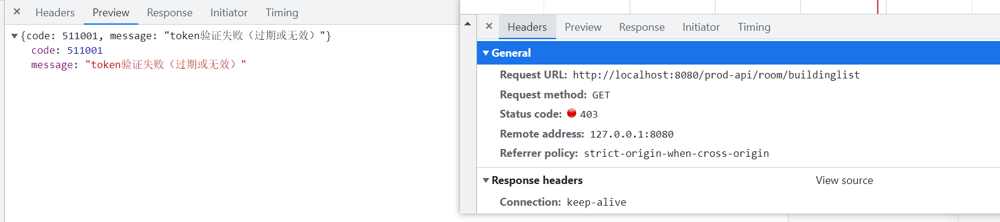
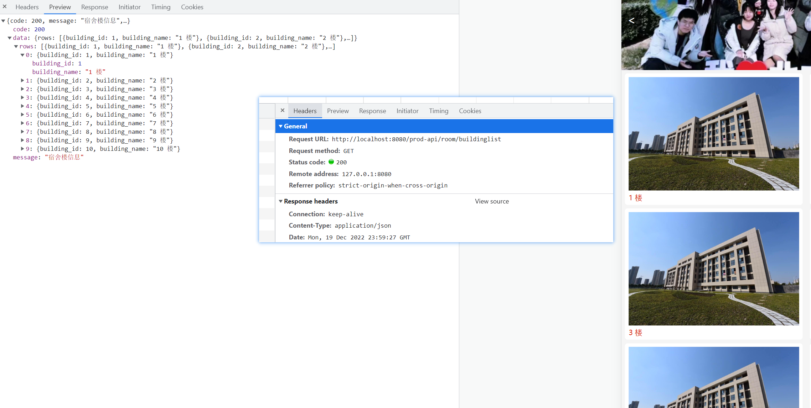
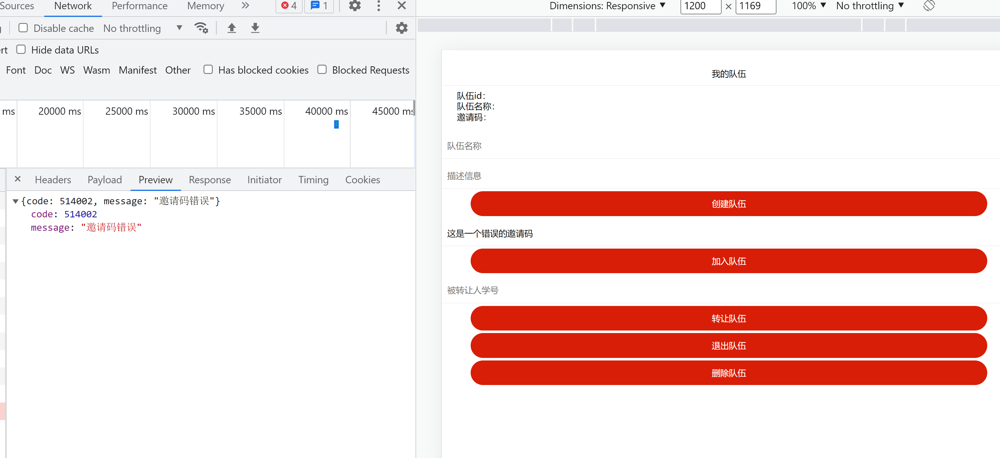

# 功能性测试

## 身份认证 API

### 登录

用户通过用户密码登录

登陆后可以查看宿舍楼信息

### 退出

退出登录之后无法访问宿舍楼信息返回 403

### 刷新 Token

## 

## 个人信息 API

### 获取个人信息

登陆后查看个人信息

### 修改密码

### 获取我的宿舍信息

未进行选宿舍之前，不存在床位

## 

## 宿舍资源 API

### 获取宿舍楼列表

获取所有的宿舍楼信息

### 获取宿舍楼详情信息

点击对应的宿舍楼，获取宿舍楼的详情信息

### 获取房间信息

### 获取空床数据

在选宿舍界面获取到每栋宿舍楼的空窗信息如下

## 

## 组队管理 API

### 创建队伍

创建一个队伍

### 删除队伍

删除队伍需要分以下几种情况

1. 没有队伍
   
   - 无法删除队伍
   
   

2. 是队长
   
   - 可以直接删除队伍。注意这里和退出队伍有所区别，即使队伍人数大于 1，队长仍然可以直接删除(解散)队伍
   
   

3. 不是队长
   
   - 无法删除队伍

### 加入队伍

加入队伍需要考虑以下几种错误

1. 当前用户已经有队伍
   
   

2. 邀请码错误或者队伍不处于活跃状态(已完成订单或者已删除)
   
   

3. 用户与队伍队长性别不一致
   
   

4. 队伍人数已满
   
   

若以上条件均满足，则可以成功加入队伍

### 退出队伍

用户退出队伍需要考虑以下几种错误

1. 用户没有加入任何队伍

2. 用户是队长且人数大于1，此时必须要先进行转让才能退出队伍
   
   

若以上条件均满足，则可以成功退出队伍

### 我的队伍

### 转让队长

## 订单管理 API

### 提交订单

### 获取订单列表

### 获取订单信息
