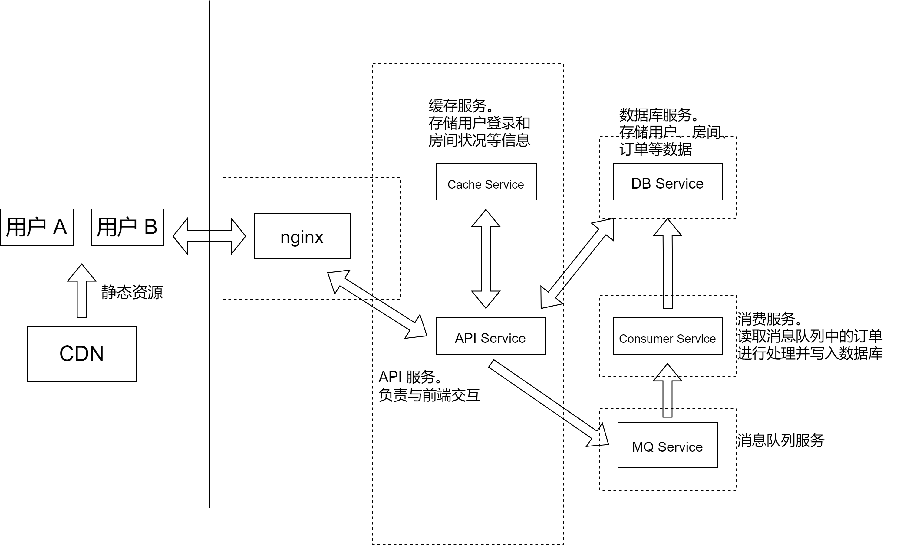

# Overview

## 系统设计



系统设计如上图所示，主要包括以下几个服务

- CDN 服务
  
  - 负责提供静态资源

- 反向代理服务

- API 服务
  
  - 提供后端 API，负责与前端进行交互

- 缓存服务
  
  - 缓存用户登录和房间信息

- 消息队列服务
  
  - 订单消息从发送方(API 服务)到接收方(消息服务)之间的传递

- 订单消费服务
  
  - 处理订单请求

- 数据库服务
  
  - 存储数据

为了简单起见，本设计中将 API 服务和缓存服务放到同一个节点上

## 部署

目前已经支持了以下四种服务的部署，包括

- [API 服务](/services/api-service)

- [消费服务](/services/consumer-service)

- [数据库服务](/services/consumer-service)

- [消息队列服务](/services/mq-service)

在进行部署之前，务必确认 API 服务和消费服务中相关的环境变量与数据库服务和消息队列服务中的环境变量一致(包括用户名、密码以及相应的端口号等)

> 详见各个目录下的 .env 文件

1. 部署数据库服务
   
   ```bash
   cd services/db-service
   docker compose up -d
   ```

2. 部署消息队列服务
   
   ```bash
   cd services/mq-service
   docker compose up -d
   ```

3. 部署 API 服务
   
   ```bash
   cd services/api-service
   docker compose up -d
   ```

4. 部署消费服务
   
   ```bash
   cd services/consumer-service
   docker compose up -d
   ```

**注意：:warning:**

- 需要先部署数据库服务和消息队列服务(被 API 服务和消费服务依赖)

- 目前 API 服务仅在初始化时创建了数据表，并返回 mock 的数据，并未与数据库有交互
  
  - 若要测试登录，可使用以下数据
    
    ```json
    {
        "username": "qiufeng",
        "password": "123456"
    }
    ```

- 消费服务目前仅实现了从消息队列中读取数据并打印的功能
  
  - 如果需要验证是否部署成功，可以生成订单之后查看消费服务的日志
    
    ```bash
    cd services/consumer-service
    docker compose logs
    ```
  
  - 或者登录 RabbitMQ 的管理页面进行查看(用户密码和端口号可参见 `services/mq-service/.env`)
